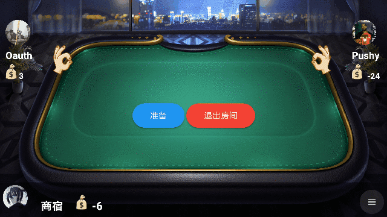
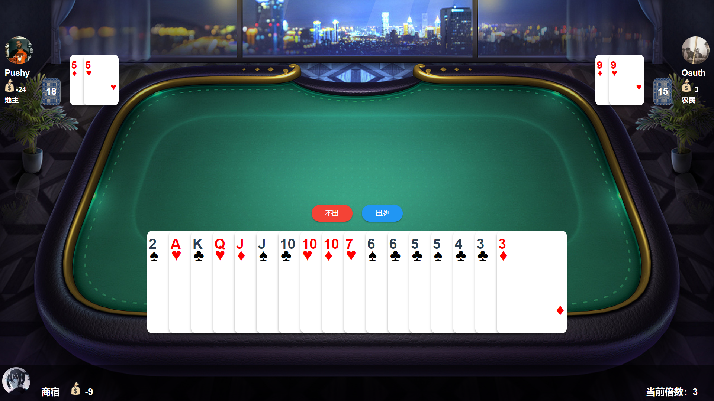
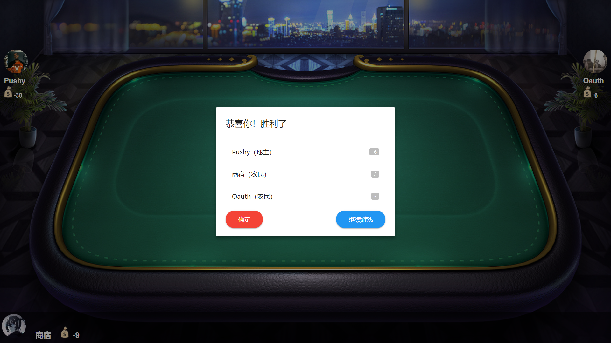

# Landlords

## 简介

`Landlords`是一款可以在线和好友斗地主的游戏，开发初心是因为市面上的大多数斗地主游戏都不支持好友同玩。而`Landlords`则可以满足你和好友开黑的乐趣！

## 游戏截图

**游戏大厅**

**发牌动画**

**出牌回合**

**结束计分板**

## 设计思路

如果你对这个的后台设计思路感兴趣，可以阅读我的博客中斗地主的相关系列：

[H5斗地主游戏应用后台教程（一）—— 应用和个体的总体设计](https://pushyzheng.com/posts/tech/h5-斗地主游戏后端教程一/)

[H5斗地主游戏应用后台教程（二）—— 算法模块的实现](https://pushyzheng.com/posts/tech/h5-斗地主游戏后端教程二/)

[H5斗地主游戏应用后台教程（三）—— 业务模块的实现](https://pushyzheng.com/posts/tech/h5-斗地主游戏后端教程三/)

## 贡献者

感谢以下开发者对本项目的贡献：

`Fx12138`

## 联系我

如果您在游戏的过程中遇到任何`bug`或者您有什么改进的建议，以及有项目的实现细节需要提问，都可以通过下面的联系方式联系我：

- Email：1437876073@qq.com
- QQ：1437876073

